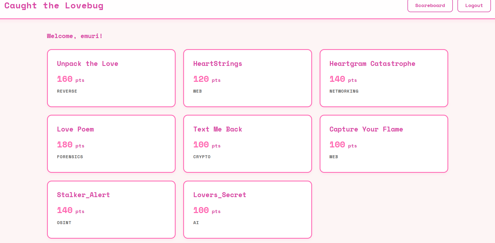

---

 

This is the platform that was used to host the **Caught the Lovebug** competition on February 11th 2026. Created to incorporate an easy integration of challenge deployments and participation through the 2 hours competition hosted by the **Capture the Flame** 2026 Board.  

Holding 8 challenges made by the experience team, this platform allowed for an easy and reliable alternative to hosting CTFs. 

 

## Features
- **8 challenges** available for 50 active participants  
- **Dynamic** scoring system  
- **Real-time** UI updates and notifications 
- User registration  
- Leaderboard tracking for competitor progression  

## Tech stack
- React
- Django
- PostgreSQL

<!-- 

 -->

## How was it used?

The challenge was deployed to host the competition, allowing for the Capture the Flame team to 
- Reliably distribute challenge files
- Validate user input
- Declare a winner after two hours of use 

## Try it out

Try out the deployed website here: https://lovebug-ctf.vercel.app/ 

**NOTE**: Website will be taken down 02/18/2026 11:59 CST

## Creator

### Anirudh Yallapragada

